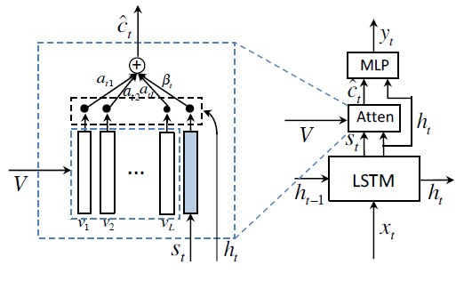
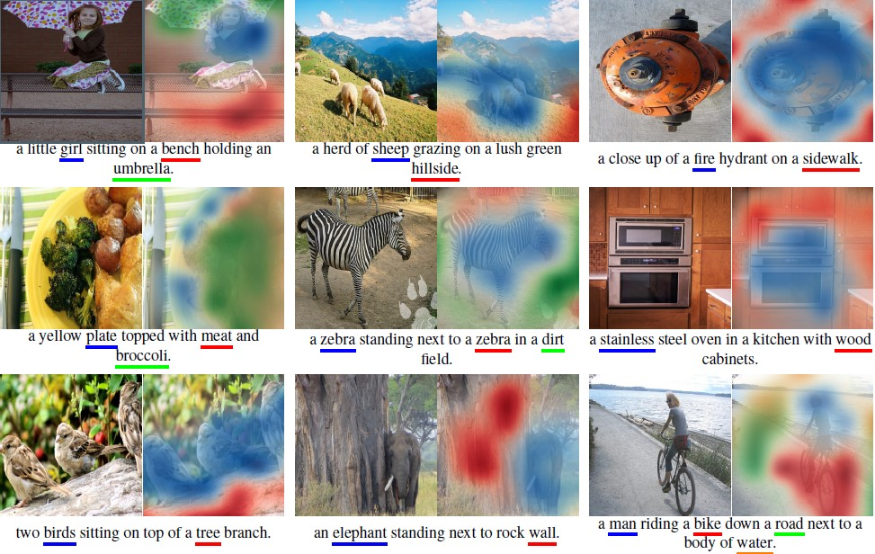

# Knowing When to Look: Adaptive Attention via a Visual Sentinel for Image Captioning

The paper can be found [here](https://arxiv.org/pdf/1612.01887v2.pdf)
My implementation of the paper can be found [here](https://github.com/abhipraay/NLP/blob/main/Image%20Captioning/using_adaptive_attention.ipynb)

## Introduction

Automatically generating captions for images has emerged as a prominent interdisciplinary research problem in both academia and industry. It can aid visually impaired users, and make it easy for users to organize and navigate through large amounts of typically unstructured visual data. Image captioning models usually use attention based neural encoder – decoder models where at each time step the decoder attends to the image to produce the next word. However not all words need to attend to the image.
Let’s the take the example of the caption: “A white bird perched on top of a red stop sign”
Words like “a” and “of” do not need to attend to the image. Moreover, at times the language model is sufficient to produce the next words, for example, when “a red stop” is followed by “sign” or when “on” and “top” is following “perched”.
In fact, gradients from non-visual words could mislead and diminish the overall effectiveness of the visual signal in guiding the caption generation process.
Thus, the Authors of this paper have suggested an adaptive attention architecture where the model can automatically decide when to rely on the visual part or when to rely on the language model.

## Architecture

## Encoder:
The encoder used is Resnet, where we take the outputs of the last convolutional layer. The dimensions of the outputs are 2048x7x7. We convert this to a 49x2048 dimensional vector space (V) where we have 49 vectors, each corresponding to different parts of the image. 

## Attention model and decoder:
First, we find a context vector the same way it is done in the other models. You can refer to this [paper](https://arxiv.org/pdf/1502.03044.pdf) for a better understanding. So first we find z vector by passing hidden state and the V vector through a fully connected layer. Then we apply softmax to the z vector, to obtain the coefficients(a) for each of the vector vi in V. Then we add them (a1v1 + a2v2…. +a49v49) to obtain the vector c.

           (1(T) is the transpose of a matrix of only ones)  (h(t) is the hidden state at time t)  

So, in the normal attention model we directly pass ct and ht through a fully connected layer to obtain the probability distribution. But in the proposed architecture there is another step.

The authors have introduced a visual sentinel s(t) which can be obtained by:

m is the memory state of the LSTM

Now our new context vector is obtained by 

b is obtained by sending visual sentinel and hidden state through a fully connected layer, and then concatnating that with the z vector. Then we apply softmax and take the last entry as b.

By performing the above computations we can decide when to look at the image ( when b = 0) and when to completely ignore the image and look at the language model ( when b = 1). We can also notice that when b is equal to 0 it is the same as the normal attention models.

So finally, to obtain the probability distributions we pass c1(t) and h(t) through a fully connected layer.

## Authors Results
 

