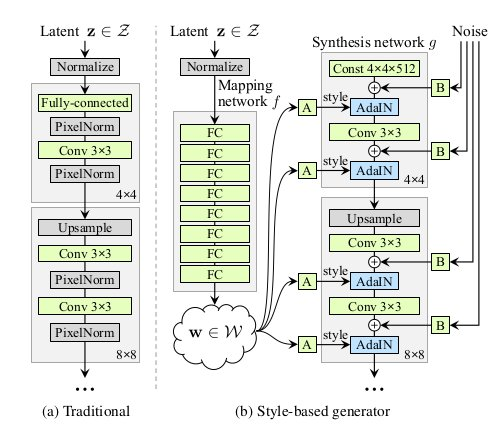
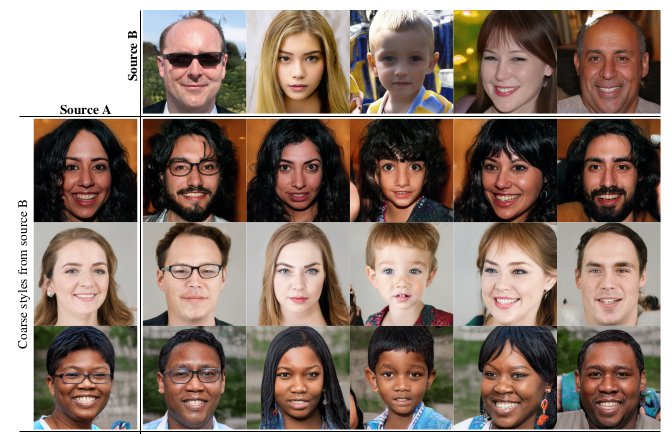

# [A Style-Based Generator Architecture for Generative Adversarial Networks](https://arxiv.org/pdf/1812.04948.pdf)

## Summary 

An alternative generator architecture for generative adversarial networks from style transfer literature. This architecture leads to an automatically learned, unsupervised separation of high-level attributes and stocastic variation in generated images.

Motivated by style transfer literature, the generator architecture is re-designed in a way that exposes nobel ways to control the image synthesis process. The generator starts from a learned constant input and adjusts the style of the image at each convolutional layer based on the latent code. Combined with the noise directly injected into the network, this architectural change leads to automatic unsupervised seperation of high-level attributes.

### Approach

The generator embeds the input latent code into an intermediate latent space, which has a profound effect on how the factors of variation are represented in the network. The input latent space myst follow the probability density of the training data which leads to some degree of entanglement. The intermediate latent space is free from that restriction. 

As previoused methods for estimating the degree of latent space disentanglement are not directly applicable in our case, therefore two new automated metrics
* Perceptual Path Length
* Linear Separability
for quantifying these aspects of the generator.

## Architecture

### Style-based Generator

The latent code is provided to the generator through an input layer, i.e., the first layer of a Feed Forward Network. The input layer is ommited altogether, instead a learned constant is used.

Given a latent code **z** in the input latent space, a non-linear mapping network first produces **w**, the intermediate latent space. The dimensionality of both the spaces are 512 and the mapping f is implemented using an 8-layer MLP. The learned affine transformations then specialize **w** to styles **y** that control adaptive instance normalization (AdaIN) operations after every convolution layer of the synthesis network g.

The generator is also provided with a direct means to generate stochastic detail by introducing explicit noise inputs. The noise image is broadcasted to all feature maps using learned perfeature scaling factors and then added to the output of the corresponding convolution.

The baseline configuration is the Progressive GAN from which the network and some hyperparameters are inherited, which is then improved by using bilinear up/down sampling operations.

This baseline is improved further by adding the mapping network and AdaIN operations.

Finally, the noise inputs are introduced that improve results further as well as novel mixing regularization that decorrelates neighboring styles.

### Evaluation

The method is evaluated using different loss functions. For CelebA-HQ, we primarily use WGAN-GP, while for FFHQ, we use WGAN-GP and a non-saturating loss with R1 regularization.

### Style-Mixing

To further encourage the styles to localize, a mixing regularization, is employed where a given percentage of images are generated using two latent codes instead of one during training. When generating such an image, a simple switch from one latent code to another is made at a randomly selected point in the synthesis network. 

### Stochastic Variation

There are many aspects in human portraits that can be
regarded as stochastic, such as the exact placement of hairs. These can be randomized without affecting the perception of the image as long as they follow the correct distribution.

The effect of noise appears tightly localized in the network. A set of noise is introduced at every layer and thus, there is no incentive to generate the stochastic effects from earlier activations, leading to localized efect.

## Disentanglement

The common goal is a latent space that consists of linear subspaces each of which controls one factor of variation. However, the sampling probability of each combination of factors in Z needs to match the corresponding density in the training data. 

The benefit of this generator architecture is that the
intermediate latent space W does not have to support sampling according to any fixed distribution.

The metrics recently proposed for quantifying disentanglement require an encoder network that maps input images to latent codes. 
Two new ways of quantifying disentanglement, neither of which requires an encoder and are therefore computable for any image dataset and generator.

### Perceptual Path Length

Interpolation of latent space vectors may yeild surprisingly non-linear changes in the image. For example, features that are absent in either endpoint may appear in the middle of a linear interpolation path, which indicates that the latent space is entangled and the factors of variation are not properly seperated. 

As a basis for this metric, a perceptually-based pairwise image distance that is calculated as a weight difference between two VGG16 embeddings where the weights are fit so that the metric agrees with human perceptual similarity judgements. 

If the latent space interpolation pah is subdivided into linear segments, a total perceptual length of this segmented path can be defined as the sum of perceptual differences over each segment. 

### Linear Separability 

If a latent space is sufficiently disentangled, it should be possible to find direction vectors that consistently correspond to individual factors of variation. By measuring how well the latent-space points can be seperated into distinct sets quantifies another metric.

## Results

## Implementation

* [StyleGAN Implementation](https://github.com/NVlabs/stylegan)

* [StyleGAN2 Implementation](https://github.com/NVlabs/stylegan2)